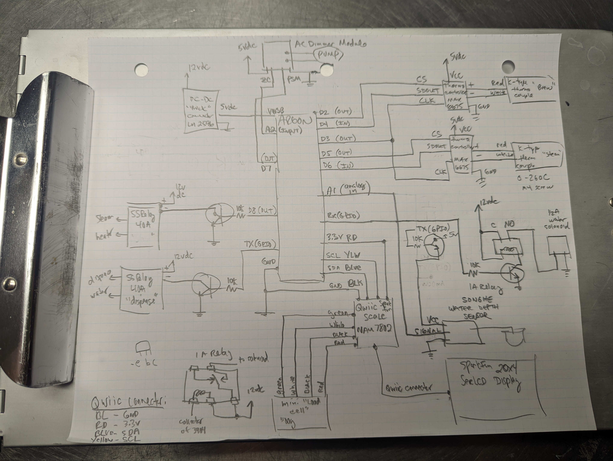

# roboGaggia - TL;DR

This project is a hardware-hack of the amazing [Gaggia Pro](https://www.wholelattelove.com/products/gaggia-classic-pro-espresso-machine-in-cherry-red?gclid=Cj0KCQjw-fmZBhDtARIsAH6H8qj_Ss3SJIp0CvJAVQRKj4xInX0PIXOTgVx_EXvSSFgazGyuVBLtaYUaAsB3EALw_wcB)

Although it's an amazing machine, the Gaggia requires a number of manual steps to get you from beans to a hot latte:

1. You have to periodically pour water into the top of the Gaggia to refill the water reservoir.  This can be an inconvenience if your Gaggia is under a kitchen cabinet.
2. After you've loaded the portafilter with coffee grounds and put a cup under the group head, you have to wait until the brew heater achieves the correct temperature before you can click the 'brew' button.
3. While brewing, you need to remember the weight of your coffee grounds so you know how much to brew. You need to either weigh your resulting coffee using an external scale or approximate the output by counting the seconds of your extraction.
4. After brewing, you then have to manually switch the 'steam' button and wait for the heater to achieve the steam temperature.
5. After steaming, if you want to brew again, you have to go through the process of extracting water to cool off the heater - the heater is always on with the stock Gaggia, so cooling off the heateater takes a while.

Other things to note about the stock Gaggia Pro:

1. The thermostats which measure the brew and steam temperatures employ a simplistic 'Schmitt Trigger' control algorithm which means the target temperature can vary quite a bit from shot to shot.
2. When brewing, the water pump operates at a fixed rate, so there is no 'pre-infusion' period where the portafilter is filled with low-pressure water before the high pressure water is used to extract the espresso shot.

In an attempt to mitigate the above Gaggia short comings, I've implemented the following features:

1. Integrated scale that fits in the drip tray
2. Dual PID temperature controllers
3. Flow control
4. Auto-Fill water reservoir
5. Microcontroller-based automated brew process that eliminates the need for the Brew or Steam buttons.
6. Cool-down feature to assist in cooling down the heater for brewing.

# Disclaimer

This project involves modifying a perfectly safe commercial espresso machine.  These modifications absolutely make your espresso machine less safe.  It involves both water and electricity.  Please proceed at your own risk.  This is a dangerous modification! If you don't do it right, people will die over a cup of coffee! 

These instructions assume you are proficient in handling both DC and AC electrical components.  If you are not, this is not the project for you, sorry!

Ok, sorry, that's a rather depressing Disclaimer :-(

# Parts List

I will explain in detail how each of these are used. Here is a list of all major components needed for this modification and links to where you can acquire them.  The brown parts in the above [Robo Gaggia](media/gaggia1.jpg) diagram are all 3D printed.  I designed them using Fusion 360. Below, I've included links to the resulting STL (stereolythic) files which can be used on any 3D printer.

1. [12 DC Power Supply](https://www.amazon.com/Adapter-SANSUN-AC100-240V-Transformers-Switching/dp/B01AZLA9XQ/ref=sr_1_1_sspa?keywords=12+dc+power+supply&qid=1665095810&qu=eyJxc2MiOiI0LjU4IiwicXNhIjoiNC4wMSIsInFzcCI6IjMuODUifQ%3D%3D&sprefix=12+dv+power+%2Caps%2C153&sr=8-1-spons&psc=1&spLa=ZW5jcnlwdGVkUXVhbGlmaWVyPUEzOEhBV0hCUlNURzZBJmVuY3J5cHRlZElkPUEwNzI5MTgxMVQ4UklKQVUzQTVHTCZlbmNyeXB0ZWRBZElkPUEwNjAxMjAxMUIwTTFQTUVSU0JNViZ3aWRnZXROYW1lPXNwX2F0ZiZhY3Rpb249Y2xpY2tSZWRpcmVjdCZkb05vdExvZ0NsaWNrPXRydWU=) Just buy something like this and smash it with a hammer to get to the fun parts.  You can wire this up to the interal switched-AC power inside the Gaggia.
2. [DC-DC Buck Converter](https://www.amazon.com/HiLetgo-Converter-Circuit-Regulator-Adjustable/dp/B07VJDPZ2L/ref=sr_1_1_sspa?crid=1FEW5SSDSM80M&keywords=dc+dc+buck+converter&qid=1665095735&qu=eyJxc2MiOiI1LjAyIiwicXNhIjoiNC42MCIsInFzcCI6IjQuMjgifQ%3D%3D&sprefix=dc+dc+buck+converte%2Caps%2C104&sr=8-1-spons&psc=1&spLa=ZW5jcnlwdGVkUXVhbGlmaWVyPUEyWTNJSjk3SUcyRDVKJmVuY3J5cHRlZElkPUEwODYxMzIxM1ZMSlROSVg3SjNRRSZlbmNyeXB0ZWRBZElkPUEwNzM0OTMxM1JPS1VWVDM0VTJNSSZ3aWRnZXROYW1lPXNwX2F0ZiZhY3Rpb249Y2xpY2tSZWRpcmVjdCZkb05vdExvZ0NsaWNrPXRydWU=) This is for converting the 12v to a reliable 5v with reasonable power.
3. [High Power Solid State Relay(SSR)](https://www.sparkfun.com/products/13015) (2) You drive these with 12vdc and they are able to turn on and off AC.  You will use one of these to drive the Gaggia's water pump and solenoid valve and the other to drive the heating element.  Even though the Gaggia has a 'brew' and 'steam' button.  These represent two separeate thermostats; there is only one heating element.  I mounted both of these relays on the inside of the Gaggia.  I attached them to the housing using bolts.
4. [NPN Transistor](https://www.sparkfun.com/products/521) and [10K resistors](https://www.sparkfun.com/products/11508) (4) We use these to isolate the Microntroller, which is actually turning things on and off at a logic level of 3.3V, from the 12v signal level needed to switch the SSRs.
5. [Low Power Reed Relay](https://www.amazon.com/JQC-3F-SPST-Power-Relay-Type/dp/B086Q1LGZC/ref=sxin_15_pa_sp_search_thematic_sspa?content-id=amzn1.sym.6b029eb3-7d41-4744-b45d-69fe835e098d%3Aamzn1.sym.6b029eb3-7d41-4744-b45d-69fe835e098d&crid=T6ZJDDK1ZHEC&cv_ct_cx=12v+1a+relay&keywords=12v+1a+relay&pd_rd_i=B086Q1LGZC&pd_rd_r=61bb4cc1-c6cb-468e-9ca1-02503affa67e&pd_rd_w=OpCZn&pd_rd_wg=rAtLD&pf_rd_p=6b029eb3-7d41-4744-b45d-69fe835e098d&pf_rd_r=HTYC8M5756M4QTRMA1NA&qid=1665096461&qu=eyJxc2MiOiIwLjAwIiwicXNhIjoiMC4wMCIsInFzcCI6IjAuMDAifQ%3D%3D&sprefix=12v+1a+relay%2Caps%2C83&sr=1-3-a73d1c8c-2fd2-4f19-aa41-2df022bcb241-spons&psc=1&spLa=ZW5jcnlwdGVkUXVhbGlmaWVyPUExRThEWjVFVFpCRVJXJmVuY3J5cHRlZElkPUEwOTgxMjA5MVk1WkNWRlRGS1dNWCZlbmNyeXB0ZWRBZElkPUEwNDc2NjM3MUdVQ0VBQjMyTlFNUSZ3aWRnZXROYW1lPXNwX3NlYXJjaF90aGVtYXRpYyZhY3Rpb249Y2xpY2tSZWRpcmVjdCZkb05vdExvZ0NsaWNrPXRydWU=) This is for switching the water solenoid valve for the water reservoir.
6. [Water Solenoid Valve](https://www.amazon.com/gp/product/B07NWCQJK9/ref=ppx_yo_dt_b_asin_title_o08_s00?ie=UTF8&psc=1). This has quick connectors for 1/4" water lines typically used for refridgerators. This particular item has blue lockrings for the quick connects. This valve is installed on the inside of the Gaggia using a harness I designed.  Here are the STL files for this [Solenoid Valve Harness](/3DPrints/valveBody.stl), [Solenoid Valve Hanger](/3DPrints/valveHanger.stl). You'll need to print two hangers and you will need to remove the 'water fill' spout that sits inside the rear of the Gaggia. You won't need it anymore!
7. [1/4" flexible water line and fittings](https://www.amazon.com/Malida-Tubing-purifiers-connector-10meters/dp/B07CRMDDYG/ref=sr_1_3?crid=K53OO6HGUXE8&keywords=1%2F4%22+tubing&qid=1665096609&qu=eyJxc2MiOiI0LjY4IiwicXNhIjoiNC4zMiIsInFzcCI6IjQuMjgifQ%3D%3D&s=hi&sprefix=1%2F4+tubing%2Ctools%2C92&sr=1-3) This is important for plumbing up the Gaggia to a nearby water source such as refrigerator.
8. [Particle Argon Microcontroller](https://www.sparkfun.com/products/15068) This is a Wifi-enabled Arduinio-based controller.  You program this controller using the [Visual Studio Code](https://code.visualstudio.com/) IDE with the [Particle Workbench](https://docs.particle.io/getting-started/developer-tools/workbench/) extension installed. I've included the [roboGaggia.ino](src/roboGaggia.ino) source file which can be used to program the Argon
9. [Long Quicc Cable](https://www.sparkfun.com/products/14429) (2) and [Assorted Quicc Cables](https://www.sparkfun.com/products/15081) (1) SparkFun's Quiic Connectors are used to connect together many of the electronic components on this list. These cables carry the I2C communications bus protocol.
10. [500g Mini Load Cell](https://www.sparkfun.com/products/14728) and [Qwiic Scale Controller](https://www.sparkfun.com/products/15242) The load cell is contained within a 3D-printed [Scale Enclosure](/media/scale.png). STL Files [Scale Bottom](/3DPrints/scaleBottom.stl), [Scale Top](/3DPrints/scaleTop.stl), [Scale Retainer Clip](/3DPrints/scaleRetainerClip.stl), [Scale Lid](/3DPrints/scaleLid.stl)
11. [20x4 B&W LCD Display](https://www.sparkfun.com/products/16398) This covers the Gaggia's Brew and Steam buttons becuase they are no longer required.  STL Files [LCD Bottom](/3DPrints/lcdBottom.stl), [LCD Top](/3DPrints/lcdTop.stl), [LCD Bezel](/3DPrints/lcdBezel.stl). NOTE: You need to drill a hole in the LCD Bottom for the LCD cable.  You'll see what I mean when you try to put it all together.
12. [Arcade Button](https://www.amazon.com/EG-STARTS-American-Standard-Switchable/dp/B07GBSJX2H/ref=sr_1_3?crid=1VS90HDJ5P0J1&keywords=arcade+button&qid=1665141377&qu=eyJxc2MiOiI1LjY1IiwicXNhIjoiNS4zMCIsInFzcCI6IjQuOTcifQ%3D%3D&sprefix=arcade+button%2Caps%2C84&sr=8-3) and [I2C Button Controller](https://www.sparkfun.com/products/15931) A single arcade-style button is used for all user interaction now with the Gaggia (well, other than the power switch).  You will need to solder the switch from the Arcade button to the I2C button controller.  I also bought [this button](https://www.sparkfun.com/products/10439), which is the normal switch that goes with this controller.  I tested this button to see which contacts on the controller should be soldered to the Arcade button.  Here are the STL Files [Arcade Button Enclosure](/3DPrints/buttonBody.stl) and [Arcade Button Lid](/3DPrints/buttonLid.stl)
13. [K-Type Thermocouple](https://www.amazon.com/gp/product/B07M9CB99F/ref=ppx_yo_dt_b_asin_title_o02_s00?ie=UTF8&psc=1) (2) and [Thermocouple Controller](https://www.amazon.com/gp/product/B09XVBJRV6/ref=ppx_yo_dt_b_asin_title_o03_s00?ie=UTF8&psc=1) (2) You will be replacing the Gaggia's stock thermostats with these thermocouples.  They are M4 type screws.  [Robert Kujawa](https://www.youtube.com/channel/UCV19OYaRT4ZB_Gn9uQaVgCw) has a [fine video](https://www.youtube.com/watch?v=ZAtsuS6B6xg&t=1218s&ab_channel=robertkujawa) on how to swap out these thermostats.  Ignore most of the video as it describes how to install a commercially available PID, just uset the video to learn how to access those thermostats.  The Argon Microcontroller and software that we will be using will implement both brew and steam PIDs.
14. [AC Dimmer Controller](https://www.amazon.com/gp/product/B072K9P7KH/ref=ppx_yo_dt_b_asin_title_o03_s00?ie=UTF8&psc=1) This is used to adjust the power delivered to the water pump in order to affect flow control.  At this time, only two different power settings are used. One for pre-infusion and one for brewing. 
15. [Thermal Fuse](https://www.amazon.com/gp/product/B07K35GYVJ/ref=ppx_yo_dt_b_asin_title_o04_s00?ie=UTF8&psc=1) The Gaggia is protected by a thermal fuse.  If the termperature inside the Gaggia exceeds 184C, this fuse blows and the Gaggia will stop working.  It's good to have an extra one of these :-) [This video](https://www.youtube.com/watch?v=qDc9i3p_1Xo&ab_channel=SebastianDehne) by [Sebastian Dehne](https://www.youtube.com/channel/UCV03WlzvGM_9urZA-7VE8Ww) will describe the technique you can use to replace a thermal fuse.
16. [Water Level Sensor](https://www.amazon.com/gp/product/B07THDH7Y4/ref=ppx_yo_dt_b_asin_title_o09_s00?ie=UTF8&psc=1) This is used to measure the water level in the water reservoir. The associated 3D STL files include a [Water Sensor Body](/3DPrints/waterSensor.stl), the [Water Sensor Lid](/3DPrints/waterSensorLid.stl) which seals the water sensor in the body, and the [Water Sensor Clip](/3DPrints/waterSensorClip.stl) which you can glue to the sensor body and then clip the whole sensor to the interior of the water reservoir. The software will ensure that the water never goes well below the sensor or above the sensor up to the 3D printed body.  If the water goes above the 3D printed body it could burn out the sensor (the purchase comes with many extra sensors) 

# Other modifications and purchases

These are other modifications & purchases I've made to my Gaggia which I've found useful:

1. [Bottomless Portafilter](https://www.amazon.com/gp/product/B09G56HMTG/ref=ppx_yo_dt_b_asin_title_o08_s00?ie=UTF8&psc=1) This is useful for observing how espresso is being extracted from your 'puck'
2. [High Quality Portafilter Basket](https://www.amazon.com/gp/product/B07VK1T79W/ref=ppx_yo_dt_b_asin_title_o07_s00?ie=UTF8&psc=1) 
3. [Water Filter](https://www.amazon.com/gp/product/B00CX3SYUK/ref=ppx_yo_dt_b_asin_title_o06_s00?ie=UTF8&psc=1) These are designed to be placed inside of your water reservoir.
4. [Silicon Group Head Gasket](https://www.amazon.com/gp/product/B09XK3BV4K/ref=ppx_yo_dt_b_asin_title_o06_s01?ie=UTF8&psc=1) I found that the original Gaggia gasket would leak on occasion.
5. [Shower Disk for Group Head](https://www.amazon.com/gp/product/B01H2SPMZ0/ref=ppx_yo_dt_b_asin_title_o04_s00?ie=UTF8&psc=1)
6. [Backflush Basket](https://www.amazon.com/gp/product/B09G5CG21T/ref=ppx_yo_dt_b_asin_title_o05_s00?ie=UTF8&psc=1) and [Cafeza Descaler](https://www.amazon.com/dp/B001418KNS/ref=redir_mobile_desktop?_encoding=UTF8&aaxitk=dac22d2cf9b6fdb023168565e79293bf&content-id=amzn1.sym.cf8fc959-74aa-4850-a250-1b1a4e868e60%3Aamzn1.sym.cf8fc959-74aa-4850-a250-1b1a4e868e60&hsa_cr_id=5078017130001&pd_rd_plhdr=t&pd_rd_r=33a47b4e-1e83-4084-aa60-27a7eb875301&pd_rd_w=bdtIm&pd_rd_wg=hA52R&qid=1665150405&ref_=sbx_be_s_sparkle_atgssd2_asin_0_title&sr=1-1-9e67e56a-6f64-441f-a281-df67fc737124)
7. [Over Pressure Valve](https://www.shadesofcoffee.co.uk/gaggia-classic-opv-spring-mod-kit---standard-version-just-springs) The Gaggia comes stock with a 12bar release valve.  This means the pressure will attain 12bars inside of the heater before the valve spring will release pressure.  This is appropriate if you are using the high-pressure basket that comes with the Gaggia, but if you are using a regular basket, you should dial it down to probably a 9bar spring.  This is what I've done.

# Schematic Diagram

Ok, now that you have all the parts, I will tell you how to put them together! Sorry this isn't going to be a highly detailed guide.  Everywhere there's a line, that means you use wire :-)

## Notes on the Schematic

- Don't mind my little 'e b c' bug diagram at the bottom left.  I've been an electric engineering for decades and I still forget :-)
- I used a [ProtoBoard](https://www.amazon.com/ElectroCookie-Prototype-Snappable-Electronics-Gold-Plated/dp/B081R45KN8/ref=sr_1_5?crid=3A45X18TUKLGH&keywords=protoboard&qid=1665161488&qu=eyJxc2MiOiI2LjExIiwicXNhIjoiNS43NiIsInFzcCI6IjUuNDMifQ%3D%3D&sprefix=protoboard%2Caps%2C91&sr=8-5) like this to build this circuit.  Then I printed an enclosure for it and attached it to the back of the Gaggia so it's out of the way.
- I used [Wire Wrap] and zip ties to protect all of the wires running between the various components.
- The inside of the Gaggia gets very hot, so any wires that are inside of the Gaggia should have very good insulation or protection.

# The Particle Argon Microcontroller

