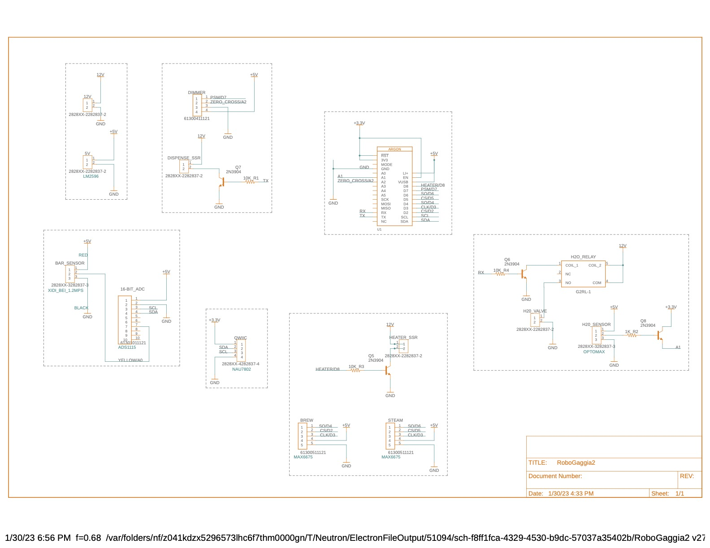
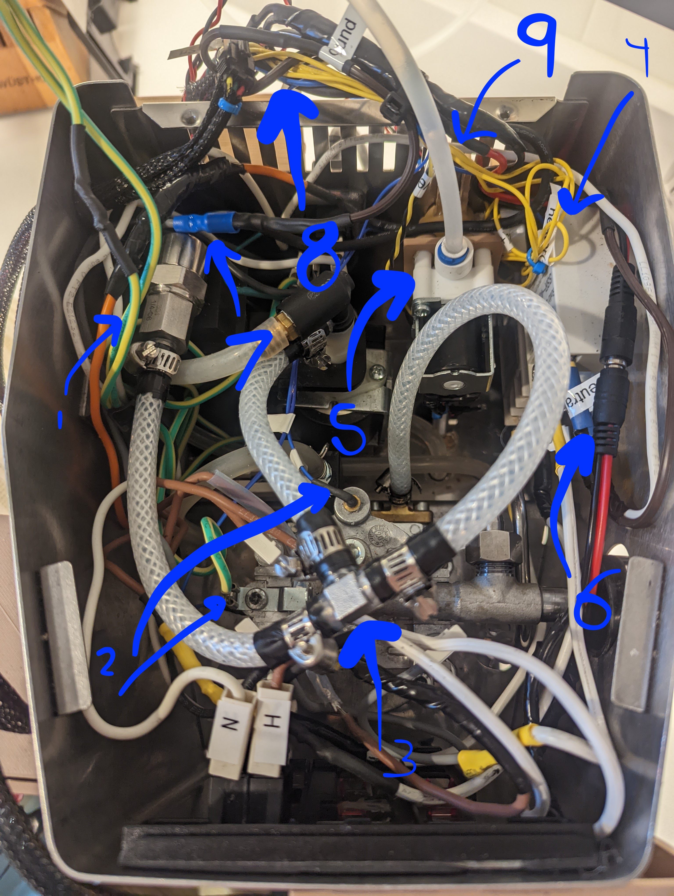

# Robo Gaggia in Action!
[Video of RoboGaggia!](https://youtu.be/2jmbiQQChrA)

[GIF of RoboGaggia extracting](/media/meCoffee.gif)

[Video of Shot Extraction Including Telemetry!](https://youtu.be/NSmCpHrQ0_Q)


# roboGaggia - TL;DR

This project is a hardware-hack of the amazing [Gaggia Pro](https://www.wholelattelove.com/products/gaggia-classic-pro-espresso-machine-in-cherry-red?gclid=Cj0KCQjw-fmZBhDtARIsAH6H8qj_Ss3SJIp0CvJAVQRKj4xInX0PIXOTgVx_EXvSSFgazGyuVBLtaYUaAsB3EALw_wcB)

Although it's an amazing machine, the Gaggia requires a number of manual steps to get you from beans to a hot latte:

1. You have to periodically pour water into the top of the Gaggia to refill the water reservoir.  This can be an inconvenience if your Gaggia is under a kitchen cabinet.
2. After you've loaded the portafilter with coffee grounds and put a cup under the group head, you have to wait until the brew heater achieves the correct temperature before you can click the 'brew' button.
3. While brewing, you need to remember the weight of your coffee grounds so you know how much to brew. You need to either weigh your resulting coffee using an external scale or approximate the output by counting the seconds of your extraction.
4. After brewing, you then have to manually switch the 'steam' button and wait for the heater to achieve the steam temperature.
5. After steaming, if you want to brew again, you have to go through the process of extracting water to cool off the heater - the heater is always on with the stock Gaggia, so cooling off the heateater takes a while.

## The above five steps are rather tedious and time consuming. It would be nice if I could load the Gaggia with fresh ground coffee, push a button, then walk away to attend to other things in my morning routine. When I return, I want my shot done and the machine ready to steam. These modifications do this.

Other things to note about the stock Gaggia Pro:

1. The thermostats which measure the brew and steam temperatures employ a simplistic 'Schmitt Trigger' control algorithm which means the target temperature can vary quite a bit from shot to shot.
2. When brewing, the water pump operates at a fixed rate, so there is no 'pre-infusion' period where the portafilter is filled with low-pressure water before the high pressure water is used to extract the espresso shot.

In an attempt to mitigate the above Gaggia short comings, I've implemented the following features:

1. Integrated scale that fits in the drip tray
2. Dual PID temperature controllers
3. PID flow-rate controller that implements Pre-Infusion and a fixed Flow Profile.  
4. Live flow telemetry sent to Adafruit.IO for flow analytics
5. Auto-Fill water reservoir
6. Auto-Shutoff
7. Microcontroller-based automated brew process that eliminates the need for the Brew or Steam buttons.
8. Cool-down feature to assist in cooling down the heater for alternating between brewing and steaming.  This is important for single-boiler machines such as the Gaggia.
9. Clean feature which automates much of the rather tedious process of backflushing the Gaggia's grouphead with Cafiza cleaner.
10. All additional electrical features are installed on a separate printed circuit board (PCB) which is attached on the back of the Gaggia.  The designs for this PCB are included in this repo with instructions on how to get the board fabricated.


# Disclaimer

This project involves modifying a perfectly safe commercial espresso machine.  These modifications absolutely make your espresso machine less safe.  It involves both water and electricity.  Please proceed at your own risk.  This is a dangerous modification! If you don't do it right, people will die over a cup of coffee! 

These instructions assume you are proficient in handling both DC and AC electrical components and plumbing.  If you are not, this is not the project for you at this time, sorry!  Learn with other projects and then come back to this one :-)

Also, I know absolutely NOTHING about proper coffee.  It's quite possible everything I'm doing here is wrong, so don't yell at me.  Anything I do know, I've learned by watching the awesome coffee videos from [James Hoffman](https://www.youtube.com/channel/UCMb0O2CdPBNi-QqPk5T3gsQ)


# Parts List

I will explain in detail how each of these are used. Here is a list of all major components needed for this modification and links to where you can acquire them.  The brown parts in the above [Robo Gaggia](media/gaggia1.jpg) diagram are all 3D printed.  I designed them using Fusion 360. Below, I've included links to the resulting STL (stereolythic) files which can be used on any 3D printer.

1. [12 DC Power Supply](https://www.amazon.com/gp/product/B07SJRX9R6/ref=ppx_yo_dt_b_asin_title_o04_s00?ie=UTF8&th=1) and the [DC-DC Buck Converter](https://www.amazon.com/HiLetgo-Converter-Circuit-Regulator-Adjustable/dp/B07VJDPZ2L/ref=sr_1_1_sspa?crid=1FEW5SSDSM80M&keywords=dc+dc+buck+converter&qid=1665095735&qu=eyJxc2MiOiI1LjAyIiwicXNhIjoiNC42MCIsInFzcCI6IjQuMjgifQ%3D%3D&sprefix=dc+dc+buck+converte%2Caps%2C104&sr=8-1-spons&psc=1&spLa=ZW5jcnlwdGVkUXVhbGlmaWVyPUEyWTNJSjk3SUcyRDVKJmVuY3J5cHRlZElkPUEwODYxMzIxM1ZMSlROSVg3SjNRRSZlbmNyeXB0ZWRBZElkPUEwNzM0OTMxM1JPS1VWVDM0VTJNSSZ3aWRnZXROYW1lPXNwX2F0ZiZhY3Rpb249Y2xpY2tSZWRpcmVjdCZkb05vdExvZ0NsaWNrPXRydWU=) are both combined together to provide 12Vdc and 5Vdc. The [3D STL file for the AC/DC power enclosure body](/3DPrints/Power_body.stl) and [enclosure lid](/3DPrints/Power_lid.stl) are included.
2. [High Power Solid State Relay(SSR)](https://www.sparkfun.com/products/13015) (1) You drive this with 12vdc and it's used to turn on and off AC.  This is used to switch the 'solenoid valve' on the Gaggia which determines if water goes to the brewhead or the steam wand.  I mounted this on the inside of the Gaggia using bolts.
3. [NPN Transistor](https://www.sparkfun.com/products/521) and [10K resistors](https://www.sparkfun.com/products/11508) (4) We use these to isolate the Microntroller, which is actually turning things on and off at a logic level of 3.3V, from the 12v signal level needed to switch the SSRs.
4. [Low Power Reed Relay](https://www.amazon.com/JQC-3F-SPST-Power-Relay-Type/dp/B086Q1LGZC/ref=sxin_15_pa_sp_search_thematic_sspa?content-id=amzn1.sym.6b029eb3-7d41-4744-b45d-69fe835e098d%3Aamzn1.sym.6b029eb3-7d41-4744-b45d-69fe835e098d&crid=T6ZJDDK1ZHEC&cv_ct_cx=12v+1a+relay&keywords=12v+1a+relay&pd_rd_i=B086Q1LGZC&pd_rd_r=61bb4cc1-c6cb-468e-9ca1-02503affa67e&pd_rd_w=OpCZn&pd_rd_wg=rAtLD&pf_rd_p=6b029eb3-7d41-4744-b45d-69fe835e098d&pf_rd_r=HTYC8M5756M4QTRMA1NA&qid=1665096461&qu=eyJxc2MiOiIwLjAwIiwicXNhIjoiMC4wMCIsInFzcCI6IjAuMDAifQ%3D%3D&sprefix=12v+1a+relay%2Caps%2C83&sr=1-3-a73d1c8c-2fd2-4f19-aa41-2df022bcb241-spons&psc=1&spLa=ZW5jcnlwdGVkUXVhbGlmaWVyPUExRThEWjVFVFpCRVJXJmVuY3J5cHRlZElkPUEwOTgxMjA5MVk1WkNWRlRGS1dNWCZlbmNyeXB0ZWRBZElkPUEwNDc2NjM3MUdVQ0VBQjMyTlFNUSZ3aWRnZXROYW1lPXNwX3NlYXJjaF90aGVtYXRpYyZhY3Rpb249Y2xpY2tSZWRpcmVjdCZkb05vdExvZ0NsaWNrPXRydWU=) This is for switching the water solenoid valve for the water reservoir.
5. [Water Solenoid Valve](https://www.amazon.com/gp/product/B07NWCQJK9/ref=ppx_yo_dt_b_asin_title_o08_s00?ie=UTF8&psc=1). This has quick connectors for 1/4" water lines typically used for refridgerators. This particular item has blue lockrings for the quick connects. This valve is installed on the inside of the Gaggia using a harness I designed.  Here are the STL files for this [Solenoid Valve Harness](/3DPrints/valveBody.stl), [Solenoid Valve Hanger](/3DPrints/valveHanger.stl). You'll need to print two hangers and you will need to remove the 'water fill' spout that sits inside the rear of the Gaggia. You won't need it anymore!
6. [1/4" flexible water line and fittings](https://www.amazon.com/Malida-Tubing-purifiers-connector-10meters/dp/B07CRMDDYG/ref=sr_1_3?crid=K53OO6HGUXE8&keywords=1%2F4%22+tubing&qid=1665096609&qu=eyJxc2MiOiI0LjY4IiwicXNhIjoiNC4zMiIsInFzcCI6IjQuMjgifQ%3D%3D&s=hi&sprefix=1%2F4+tubing%2Ctools%2C92&sr=1-3) This is important for plumbing up the Gaggia to a nearby water source such as refrigerator.
7. [Particle Argon Microcontroller](https://www.sparkfun.com/products/15068) This is a Wifi-enabled Arduinio-based controller.  You program this controller using the [Visual Studio Code](https://code.visualstudio.com/) IDE with the [Particle Workbench](https://docs.particle.io/getting-started/developer-tools/workbench/) extension installed. I've included the [roboGaggia.ino](src/roboGaggia.ino) source file which can be used to program the Argon
8. [Long Quicc Cable](https://www.sparkfun.com/products/14429) (2) and [Assorted Quicc Cables](https://www.sparkfun.com/products/15081) (1) SparkFun's Quiic Connectors are used to connect together many of the electronic components on this list. These cables carry the I2C communications bus protocol.
9. [500g Mini Load Cell](https://www.sparkfun.com/products/14728) and [Qwiic Scale Controller](https://www.sparkfun.com/products/15242) The load cell is contained within a 3D-printed [Scale Enclosure](/media/scale.png). STL Files [Scale Bottom](/3DPrints/scaleBottom.stl), [Scale Top](/3DPrints/scaleTop.stl), [Scale Retainer Clip](/3DPrints/scaleRetainerClip.stl), [Scale Lid](/3DPrints/scaleLid.stl)
10. [20x4 B&W LCD Display](https://www.sparkfun.com/products/16398) This covers the Gaggia's Brew and Steam buttons becuase they are no longer required.  STL Files [LCD Bottom](/3DPrints/lcdBottom.stl), [LCD Top](/3DPrints/lcdTop.stl), [LCD Bezel](/3DPrints/lcdBezel.stl). NOTE: You need to drill a hole in the LCD Bottom for the LCD cable.  You'll see what I mean when you try to put it all together.
11. [Arcade Button](https://www.amazon.com/EG-STARTS-American-Standard-Switchable/dp/B07GBSJX2H/ref=sr_1_3?crid=1VS90HDJ5P0J1&keywords=arcade+button&qid=1665141377&qu=eyJxc2MiOiI1LjY1IiwicXNhIjoiNS4zMCIsInFzcCI6IjQuOTcifQ%3D%3D&sprefix=arcade+button%2Caps%2C84&sr=8-3) and [I2C Button Controller](https://www.sparkfun.com/products/15931) A single arcade-style button is used for all user interaction now with the Gaggia (well, other than the power switch).  You will need to solder the switch from the Arcade button to the I2C button controller.  I also bought [this button](https://www.sparkfun.com/products/10439), which is the normal switch that goes with this controller.  I tested this button to see which contacts on the controller should be soldered to the Arcade button.  Here are the STL Files [Arcade Button Enclosure](/3DPrints/buttonBody.stl) and [Arcade Button Lid](/3DPrints/buttonLid.stl). In addition, this button enclosure is also where I put the [Qwiic Scale Controller](https://www.sparkfun.com/products/15242). Notice in the picture, the conduit from the scale leads into this enclosure.
12. [K-Type Thermocouple](https://www.amazon.com/gp/product/B07M9CB99F/ref=ppx_yo_dt_b_asin_title_o02_s00?ie=UTF8&psc=1) (2) and [Thermocouple Controller](https://www.amazon.com/gp/product/B09XVBJRV6/ref=ppx_yo_dt_b_asin_title_o03_s00?ie=UTF8&psc=1) (2) You will be replacing the Gaggia's stock thermostats with these thermocouples.  They are M4 type screws.  [Robert Kujawa](https://www.youtube.com/channel/UCV19OYaRT4ZB_Gn9uQaVgCw) has a [fine video](https://www.youtube.com/watch?v=ZAtsuS6B6xg&t=1218s&ab_channel=robertkujawa) on how to swap out these thermostats.  Ignore most of the video as it describes how to install a commercially available PID, just uset the video to learn how to access those thermostats.  The Argon Microcontroller and software that we will be using will implement both brew and steam PIDs.
13. [AC Dimmer Controller](https://www.amazon.com/gp/product/B072K9P7KH/ref=ppx_yo_dt_b_asin_title_o03_s00?ie=UTF8&psc=1) This is used to adjust the power delivered to the water pump in order to affect flow control. The Pressure PID modulates the 'dutyCycle' of the water pump, based on pressure readings, using this dimmer.  If this dimmer is 'off', the pump is off. 
14. [Thermal Fuse](https://www.amazon.com/gp/product/B07K35GYVJ/ref=ppx_yo_dt_b_asin_title_o04_s00?ie=UTF8&psc=1) The Gaggia is protected by a thermal fuse.  If the termperature inside the Gaggia exceeds 184C, this fuse blows and the Gaggia will stop working.  It's good to have an extra one of these :-) [This video](https://www.youtube.com/watch?v=qDc9i3p_1Xo&ab_channel=SebastianDehne) by [Sebastian Dehne](https://www.youtube.com/channel/UCV03WlzvGM_9urZA-7VE8Ww) will describe the technique you can use to replace a thermal fuse.
15. [Water Level Sensor](https://www.adafruit.com/product/3397) This is used to measure the water level in the water reservoir. You can print the associated 3D STL file for the [Water Sensor Mount](/3DPrints/waterSensorMount.stl), attach the sensor to the mount, and then glue it to the interior of the water reservoir. The software will ensure that the water never goes well below the sensor or above the sensor. In the last few seconds of the [Video of RoboGaggia!](https://www.youtube.com/watch?v=cBopyQF-BVA&ab_channel=nickdipatri), I show you where this sensor is placed inside the water reservoir.
16. [Water Pressure Sensor](https://www.aliexpress.us/item/2255800570317172.html?spm=a2g0o.order_list.0.0.21ef1802Ig0OM9&gatewayAdapt=glo2usa&_randl_shipto=US), [16-bit Analog to Digital Converter](https://www.amazon.com/gp/product/B01DLHKMO2/ref=ppx_yo_dt_b_search_asin_title?ie=UTF8&psc=1), and associated [rubber tubing](https://www.cerinicoffee.com/products/high-pressure-red-tube-for-saeco-gaggia-models-sold-by-foot-16000380-996530009505), [Sensor Connector](https://www.aliexpress.com/item/2251832641599579.html?spm=a2g0o.order_list.0.0.2483180256qY54), [Connector Kit](https://www.amazon.com/gp/product/B08HJK3G92/ref=ppx_yo_dt_b_asin_title_o00_s00?ie=UTF8&psc=1), and [Y connector](https://www.aliexpress.com/item/3256802563681593.html?spm=a2g0o.order_list.0.0.2483180256qY54) The sensor is spliced into the high pressure water line between the water pump and the solenoid valve. For this install, I had to remove the heater and disconnect many wires - so take pictures before you do this! This is used by the software 'Pressure PID' to determine how much power to send to the water pump.  This gives us control over the Pressure Profile. I choose to use the 'hose clamps' that need a screwdriver rather than a crimper as these are easier to install in confined spaces. Also, the rubber hose above is reinforced. I tried many other options and they all failed. **You must use this exact hose.**
17. [RoboGaggia Printed Circuit Board 'Gerber' Design Files](/circuitBoard/roboGaggia_PCBFiles.zip) can be uploaded to [OSH Park](oshpark.com) and then you can order a PCB to be fabricated and sent to you!  It takes about 3 weeks and cost about $60 for three copies.  The PCB has NO components. You have to buy them separately.  Where the components have to go on the board, however, is labelled well so you can solder with confidence.  The [3D STL file for the PCB enclosure](/3DPrints/PCB_body.stl) are included.

# Other modifications and purchases

These are other modifications & purchases I've made to my Gaggia which I've found useful:

1. [Bottomless Portafilter](https://www.amazon.com/gp/product/B09G56HMTG/ref=ppx_yo_dt_b_asin_title_o08_s00?ie=UTF8&psc=1) This is useful for observing how espresso is being extracted from your 'puck'
2. [High Quality Portafilter Basket](https://www.amazon.com/gp/product/B07VK1T79W/ref=ppx_yo_dt_b_asin_title_o07_s00?ie=UTF8&psc=1) 
3. [Water Filter](https://www.amazon.com/gp/product/B00CX3SYUK/ref=ppx_yo_dt_b_asin_title_o06_s00?ie=UTF8&psc=1) These are designed to be placed inside of your water reservoir.
4. [Silicon Group Head Gasket](https://www.amazon.com/gp/product/B09XK3BV4K/ref=ppx_yo_dt_b_asin_title_o06_s01?ie=UTF8&psc=1) I found that the original Gaggia gasket would leak on occasion.
5. [Shower Disk for Group Head](https://www.amazon.com/gp/product/B01H2SPMZ0/ref=ppx_yo_dt_b_asin_title_o04_s00?ie=UTF8&psc=1)
6. [Backflush Basket](https://www.amazon.com/gp/product/B09G5CG21T/ref=ppx_yo_dt_b_asin_title_o05_s00?ie=UTF8&psc=1) and [Cafeza Descaler](https://www.amazon.com/dp/B001418KNS/ref=redir_mobile_desktop?_encoding=UTF8&aaxitk=dac22d2cf9b6fdb023168565e79293bf&content-id=amzn1.sym.cf8fc959-74aa-4850-a250-1b1a4e868e60%3Aamzn1.sym.cf8fc959-74aa-4850-a250-1b1a4e868e60&hsa_cr_id=5078017130001&pd_rd_plhdr=t&pd_rd_r=33a47b4e-1e83-4084-aa60-27a7eb875301&pd_rd_w=bdtIm&pd_rd_wg=hA52R&qid=1665150405&ref_=sbx_be_s_sparkle_atgssd2_asin_0_title&sr=1-1-9e67e56a-6f64-441f-a281-df67fc737124)
7. [Over Pressure Valve](https://www.shadesofcoffee.co.uk/gaggia-classic-opv-spring-mod-kit---standard-version-just-springs) The Gaggia comes stock with a 12bar release valve.  This means the pressure will attain 12bars inside of the heater before the valve spring will release pressure.  This is appropriate if you are using the high-pressure basket that comes with the Gaggia, but if you are using a regular basket, you should dial it down to probably a 9bar spring.  This is what I've done.


# More Images


# Schematic Diagram

Ok, now that you have all the parts, I will tell you how to put them together! Sorry this isn't going to be a highly detailed guide.  Everywhere there's a line, that means you use wire :-)




## Notes on the Schematic

- Don't mind my little 'e b c' bug diagram at the bottom left.  I've been an electric engineer for decades and I still forget :-)
- I used a [ProtoBoard](https://www.amazon.com/ElectroCookie-Prototype-Snappable-Electronics-Gold-Plated/dp/B081R45KN8/ref=sr_1_5?crid=3A45X18TUKLGH&keywords=protoboard&qid=1665161488&qu=eyJxc2MiOiI2LjExIiwicXNhIjoiNS43NiIsInFzcCI6IjUuNDMifQ%3D%3D&sprefix=protoboard%2Caps%2C91&sr=8-5) to build this circuit.  Then I printed an enclosure for it and attached it to the back of the Gaggia so it's out of the way.
- I used [Wire Wrap] and zip ties to protect all of the wires running between the various components.
- The inside of the Gaggia gets very hot, so any wires that are inside of the Gaggia should have very good insulation or protection.


# Logic Flow

This diagram isn't 100% accurate as I've made slight modifications, but it gives you the general idea of the user workflow using Robo Gaggia.


# The Particle Argon Microcontroller

The Particle Argon is a small microcontroller that combines WiFi and the Arduino platform. For this particular application, once the hardware modifications are made to Gaggia and it's assembled back on the kitchen counter, the WiFi feature is a great way to send updated software to the Gaggia. For example, depending on where exactly you install your water level sensor, you might need to adjust the 'minimum' and 'maximum' water level parameters in the firmware.

I would start by checking out this repo and building it using the [Visual Studio Code](https://code.visualstudio.com/) IDE with the [Particle Workbench](https://docs.particle.io/getting-started/developer-tools/workbench/) extension installed. I've included the [roboGaggia.ino](src/roboGaggia.ino) source file which can be used to program the Argon.  The accompanying [lib directory](/lib) in this repo contains all libraries you need to compile.

Please be aware that strange things can happen when using the [Particle Console](https://console.particle.io/devices) to control Robo Gaggia.  The exposed functions through the web interface are meant for testing purposes only. For example, I expose the 'startDispensing()' method so you can click the button in console and make the Gaga dispense water.  But this water will be cold and the 'water level sensor' won't be used so it's possible to run the Gaggia dry and possibly damage the water pump.


# Wiring Changes for the Gaggia

Ok, so the existing Gaggia wiring is actually quite brilliant. 

For an AMAZING explanation of how the Gaggia works, from an electrical perspective, please [read this explanation](https://comoricoffee.com/en/gaggia-classic-pro-circuit-diagram-en/) from @comoricoffee. 

The biggest change I made is I removed some stuff :-). I removed the 'Brew' and 'Steam' switches and I removed their associated 'lamps'.  None of these are necessary with Robo Gaggia! RoboGaggia still lets you brew, steam, and send hot water through the steam wand using the single arcade-button interface.

Here is a crude diagram of the changes I made (see where I added the two [High Power Solid State Relay(SSR)](https://www.sparkfun.com/products/13015) and the [AC Dimmer Controller](https://www.amazon.com/gp/product/B072K9P7KH/ref=ppx_yo_dt_b_asin_title_o03_s00?ie=UTF8&psc=1)


Below is a shot of the inside of the Gaggia with the above schematic changes:

Here are the highlights:

1. Pressure Sensor
2. Steam and Heat Thermocouples
3. Three-way splitter for plumbing in the Pressure Sensor
4. Dispense and Heat Solid State Relays
5. Water Solenoid Valve
6. Power for the RoboGaggia circuitboard
7. Dimmer output for water pump
8. Wire harness leading to RoboGaggia circuitboard
9. Water feed line to external water source





# Additional Notes

## Calibrating Sensors

Both the [Water Pressure Sensor](https://www.aliexpress.us/item/2255800570317172.html?spm=a2g0o.order_list.0.0.21ef1802Ig0OM9&gatewayAdapt=glo2usa&_randl_shipto=US) and the [500g Mini Load Cell](https://www.sparkfun.com/products/14728) are transducer sensors: they convert some form of energy to an eletrical signal. As a result, both of these devices needed to be calibrated.

Calibration is what allows us to assign a given sensor output voltage level to a useful measured value (e.g. bars of pressure or grams of weight).

Luckily, the above relationship can be expressed as a mathematical [Linear Equation](https://en.wikipedia.org/wiki/Linear_equation).

For example, we can determine the current measured water pressure, in atmospheric 'bars', of the water pressure sensor by applying its output voltage to the following equation:

measured bars = **m**(output voltage) + **b**

The calibration step involves determining what constants **m** and **b** are for a know set of input and output values.  Once we know these constants, we can use them to calculate any output pressure for any input voltage.

I took 8 data points by attaching a bicycle pump to the pressure sensor using [this NPT pressure fitting](https://www.amazon.com/gp/product/B001PLI4BA/ref=ppx_yo_dt_b_asin_title_o06_s00?ie=UTF8&psc=1).  Using [this helpful guide](https://blog.golayer.io/google-sheets/how-to-find-slope-in-google-sheets) written by [Hady Elhady](https://blog.golayer.io/author/Hady-ElHady), I imported these 8 data points into Google Sheets and calculate both **m** and **b**.  [This diagram](media/pressureCalibration.png) demonstrates my results for the Water Pressure Sensor.

I did this same process for both the water pressure sensor and the scale and the resulting **m** and **b** values are already in the code.  These values will probably work fine if the same sensors are used.

Acknowledgement: [SparkFun](https://learn.sparkfun.com/) provides great documentation on all of their products and the [Hookup Guide](https://learn.sparkfun.com/tutorials/qwiic-scale-hookup-guide?_ga=2.199132015.1304669420.1658346670-1742331242.1658055114) for their [500g Mini Load Cell](https://www.sparkfun.com/products/14728) was very helpful in understanding how to calibrate sensors.

## Calibrating the PID

"A proportional–integral–derivative controller (PID controller or three-term controller) is a control loop mechanism employing feedback that is widely used in industrial control systems and a variety of other applications requiring continuously modulated control." (https://en.wikipedia.org/wiki/PID_controller)

RoboGaggia uses a PID for both controlling the heater temperature and the brew water pressure.

The input variable to the water pressure PID is the water pressure sensor (in bars) and the output variable is the water pump duty cycle (in percentage).  The higher the duty cycle, the higher the pressure.

The PID not only compares the target water pressure to the current measured water pressure, it also considers previous values (integral) and future values (derivative).  The present (P), historical (I), and future (D) values are all scaled by an associated 'scale' factor (K). We, therefore, have Kp, Ki, and Kd constants that need to be 'tuned' for a given mechanical system.

I've followed [these general guidelines](https://en.wikipedia.org/wiki/PID_controller#Manual_tuning) for PID Tuning to come up with the values for RoboGaggia.  These should work for any RoboGaggia.

Note that if the portafiter is not filled with coffee, it will not supply 'backpressure' and so the PID will run at a constant 100% duty cycle.  So you need to either use a backflush portafilter or loaded portafilter when performing PID tuning.

In the interest of simplicity, the heater PID uses the same tuning values as the water pressure PID.  The heater temp is a slow-moving system and is therefore not as sensitive to these values.

[This PID Tuning GIF](media/PID_animation.gif) demonstrates the tradeoffs of these three tuning parameters with respect to system 'overshoot', 'oscillation', and responsiveness.

## More on Pressure and FlowRate

During the development of RoboGaggia, I migrated from 'Pressure Profiling' to 'Flow Profiling' during brewing.  What this means is, at the start, I used the system pressure as an input to the brew PID and the output was the duty cycle of the Gaggia's vibration pump.  However, after doing more research such as listening to the [Decent Folks](https://youtu.be/KsagEqYYxDw?t=604), I pivoted and now I use pressure only for pre-infusion (I keep it around 1bar), but during brewing, I drive the brew PID with the instantaneous flow rate.  For now, I keep this at around 3 grams/second.  So the PID will drive the pump's duty cycle to whatever it needs to in order to achieve a somewhat constant fow rate.  This implies that the pressure shoots up in the beginning (once the puck is saturated), but then has to get dialed back down as the flow rate increases during the shot (due to reduced coffee solids, etc.). 


## Live Flow Telemetry

To use the **Live Telemetry** feature, you need to add a `components/Secrets.h` header file containing this information:

```
  #ifndef SECRETS_H
  #define SECRETS_H

  // If you check in this code WITH this KEY defined, it will be detected by IO.Adafruit
  // and IT WILL BE DISABLED !!!  So please make sure this file is 'ignored' by your
  // source code management!
  #define AIO_USERNAME "your adafruit username"
  #define AIO_KEY "your adafruit api key"

  #endif 
```

If the above file is present, RoboGaggia will attempt to post live flow telemetry data to Adafruit.IO. 

In order to use this feature, you will need to go to Adafruit.IO and create an account.  You can then [update the code with your username and an 'API KEY'](https://github.com/ndipatri/roboGaggia/blob/main/src/roboGaggia.ino#L409).

The columns for the posted data are:

'state, measuredWeight, measuredPressure, dutyCycle, flowRate, tempC'

Telemetry is only posted during the PREINFUSION and BREWING states.

The PREINFUSION state indicates the beginning of a new brew cycle.  The target pressure is 1 bar during preInfusion and it lasts until 2 grams has been extracted.  This is to saturate the puck so it accepts higher pressures better without tunneling. 

The BREWING state indicates active brewing. A new telemetry value is posted every 1200ms.  If you post more often than this, Adafruit.IO will block the account for overusage. 

You can visit my [RoboGaggiaAndroid](https://github.com/ndipatri/RoboGaggiaAndroid) GitHub repository to download an Android app that presents this realtime Telemetry as your shot is being extracted!
