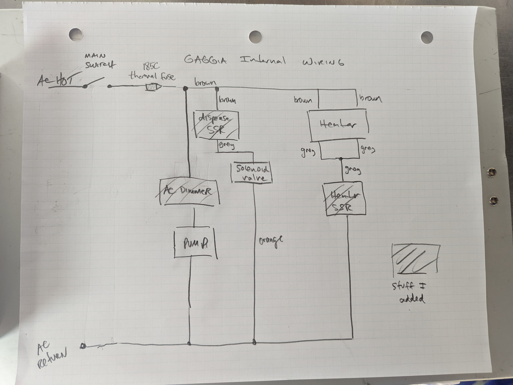

# Robo Gaggia

[Nick DiPatri](ndipatri@gmail.com)

[LinkedIn](https://www.linkedin.com/in/ndipatri/)

[Video of RoboGaggia!](https://youtu.be/XLj9ECMzo4Y?si=x9k2pggxU6RgygX5)

## Android or iOS User Interface
Robo Gaggia has a sophisticated user interface that runs on both Android and iOS.

As shown in the image above, the 'boiler on' animated graphic is inspired by the [Doom Fire Effect](https://fabiensanglard.net/doom_fire_psx/)

## Custom Brew Scale

Integrated scale tells lets Robo Gaggia fine-tune extraction pressure and brew time. 

## Live telemetry

Provides critical feedback so user can fine tune 'grind-size' and dosage.

RoboGaggia is completely driven by a custom-built brain that goes inside where the original water funnel normally fits.

# roboGaggia - TL;DR

This project is a hardware-hack of the amazing [Gaggia Pro](https://www.wholelattelove.com/products/gaggia-classic-pro-espresso-machine-in-cherry-red?gclid=Cj0KCQjw-fmZBhDtARIsAH6H8qj_Ss3SJIp0CvJAVQRKj4xInX0PIXOTgVx_EXvSSFgazGyuVBLtaYUaAsB3EALw_wcB)

Although it's an amazing machine, the Gaggia requires a number of manual steps to get you from beans to a hot latte:

1. You have to periodically pour water into the top of the Gaggia to refill the water reservoir.  This can be an inconvenience if your Gaggia is under a kitchen cabinet.
2. After you've loaded the portafilter with coffee grounds and put a cup under the group head, you have to wait until the brew heater achieves the correct temperature before you can click the 'brew' button.
3. While brewing, you need to remember the weight of your coffee grounds so you know how much to brew. You need to either weigh your resulting coffee using an external scale or approximate the output by counting the seconds of your extraction.
4. While brewing, the water pump operates at a fixed rate, so there is no 'pre-infusion' period where the portafilter is filled with low-pressure water before the high pressure water is used to extract the espresso shot. This can cause the puck to be broken up before extraction begins, resulting in uneven extraction across all coffee grounds. 
5. While brewing, the fixed rate pump causes underextraction later in the brew process as the coffee solids dissolve and provide less backpressure.
5. While brewing, the brew thermostat employs a simplistic 'Schmitt Trigger' control algorithm which means the target temperature can vary quite a bit during extraction.
5. After brewing, you then have to manually switch on the 'steam' button and wait for the heater to achieve the steam temperature.
6. After steaming, if you want to brew again, you have to go through the process of extracting water to cool off the heater - the heater is always on with the stock Gaggia, so cooling off the heateater takes a while.
7. If you leave RoboGaggia on, it will continue to heat the boiler and waste energy even if you haven't used it for hours.

## The above five steps are rather tedious and time consuming. It would be nice if I could load the Gaggia with fresh ground coffee, push a button, then walk away to attend to other things in my morning routine. When I return, I want my shot done and the machine ready to steam. These modifications do this.

In an attempt to mitigate the above Gaggia short comings, I've implemented the following features with Robo Gaggia:

1. Integrated scale that attaches magnetically to the drip tray. This only fits if you buy the [Slim Drip Tray](https://www.shadesofcoffee.co.uk/slim-drip-tray-complete-with-long-vent-tube) from Shades of Coffee.
2. Dual PID temperature controllers
3. PID flow-rate controller that implements Pre-Infusion and a fixed Flow Profile.  
4. Auto-Fill water reservoir.
5. Auto-Shutoff
6. Microcontroller-based automated brew process that eliminates the need for the Brew or Steam buttons.
7. Cool-down feature to assist in cooling down the heater for alternating between brewing and steaming.  This is important for single-boiler machines such as the Gaggia.
8. Backflush feature which automates much of the rather tedious process of backflushing the Gaggia's grouphead with Cafiza cleaner. 
9. 'Backflush Recommended' feature that maintains a 'shot count'.  
10. Separate printed circuit board (PCB) which is attached on the back of the Gaggia.  The designs for this PCB are included in this repo with instructions on how to get the board fabricated.
11. Robo Gaggia has a sophisticated user interface that runs on both Android and iOS. The [Robo Gaggia Multiplatform Mobile Application](https://github.com/ndipatri/RoboGaggiaMultiplatform) communicates with Robo Gaggia using Bluetooth.  The mobile device hangs on the front of Robo Gaggia and covers the original mechanical Gaggia brew and steam switches which are no longer needed.

# Disclaimer

This project involves modifying a perfectly safe commercial espresso machine.  These modifications absolutely make your espresso machine less safe.  It involves both water and electricity.  Please proceed at your own risk.  This is a dangerous modification! If you don't do it right, people will die over a cup of coffee! 

These instructions assume you are proficient in handling both DC and AC electrical components and plumbing.  If you are not, this is not the project for you at this time, sorry!  Learn with other projects and then come back to this one :-)

Also, I know absolutely NOTHING about proper coffee.  It's quite possible everything I'm doing here is wrong, so don't yell at me.  Anything I do know, I've learned by watching the awesome coffee videos from [James Hoffman](https://www.youtube.com/channel/UCMb0O2CdPBNi-QqPk5T3gsQ)

I also want to give a shout-out to another great Gaggia hack, the [Gaggiaduino Project!](https://gaggiuino.github.io/#/)  

# Parts List

I will explain in detail how each of these are used. Here is a list of all major components needed for this modification and links to where you can acquire them.  Many parts are 3D printed.  I designed them using Fusion 360. Below, I've included links to the resulting STL (stereolythic) files which can be used on any 3D printer.

1. [12 DC Power Supply](https://www.amazon.com/gp/product/B07SJRX9R6/ref=ppx_yo_dt_b_asin_title_o04_s00?ie=UTF8&th=1) and the [DC-DC Buck Converter](https://www.amazon.com/HiLetgo-Converter-Circuit-Regulator-Adjustable/dp/B07VJDPZ2L/ref=sr_1_1_sspa?crid=1FEW5SSDSM80M&keywords=dc+dc+buck+converter&qid=1665095735&qu=eyJxc2MiOiI1LjAyIiwicXNhIjoiNC42MCIsInFzcCI6IjQuMjgifQ%3D%3D&sprefix=dc+dc+buck+converte%2Caps%2C104&sr=8-1-spons&psc=1&spLa=ZW5jcnlwdGVkUXVhbGlmaWVyPUEyWTNJSjk3SUcyRDVKJmVuY3J5cHRlZElkPUEwODYxMzIxM1ZMSlROSVg3SjNRRSZlbmNyeXB0ZWRBZElkPUEwNzM0OTMxM1JPS1VWVDM0VTJNSSZ3aWRnZXROYW1lPXNwX2F0ZiZhY3Rpb249Y2xpY2tSZWRpcmVjdCZkb05vdExvZ0NsaWNrPXRydWU=) are both combined together to provide 12Vdc and 5Vdc. The [3D STL file for the AC/DC power enclosure body](/3DPrints/gaggia3Power.stl) and [enclosure lid](/3DPrints/gaggia3Power_lid.stl) are included. The power enclosure goes inside of the Gaggia, attached to the side of the [Main Gaggia Brain Armature 3D STL file](/3DPrints/gaggiaArmature.stl).
2. [High Power Solid State Relay(SSR)](https://www.sparkfun.com/products/13015) (2) You drive these SSDs with 12vdc and they can switch on and off a much higher power AC current. One of these is used to open the 'solenoid valve' which dispenses water from the boiler and the other is used to turn on and off the boiler heater. I mounted these on the inside of the Gaggia using bolts.
3. [NPN Transistor](https://www.sparkfun.com/products/521) and [10K resistors](https://www.sparkfun.com/products/11508) (4) We use these to isolate the Microntroller, which is actually turning things on and off at a logic level of 3.3V, from the 12v signal level needed to switch the SSRs.
4. [Low Power Reed Relay](https://www.amazon.com/JQC-3F-SPST-Power-Relay-Type/dp/B086Q1LGZC/ref=sxin_15_pa_sp_search_thematic_sspa?content-id=amzn1.sym.6b029eb3-7d41-4744-b45d-69fe835e098d%3Aamzn1.sym.6b029eb3-7d41-4744-b45d-69fe835e098d&crid=T6ZJDDK1ZHEC&cv_ct_cx=12v+1a+relay&keywords=12v+1a+relay&pd_rd_i=B086Q1LGZC&pd_rd_r=61bb4cc1-c6cb-468e-9ca1-02503affa67e&pd_rd_w=OpCZn&pd_rd_wg=rAtLD&pf_rd_p=6b029eb3-7d41-4744-b45d-69fe835e098d&pf_rd_r=HTYC8M5756M4QTRMA1NA&qid=1665096461&qu=eyJxc2MiOiIwLjAwIiwicXNhIjoiMC4wMCIsInFzcCI6IjAuMDAifQ%3D%3D&sprefix=12v+1a+relay%2Caps%2C83&sr=1-3-a73d1c8c-2fd2-4f19-aa41-2df022bcb241-spons&psc=1&spLa=ZW5jcnlwdGVkUXVhbGlmaWVyPUExRThEWjVFVFpCRVJXJmVuY3J5cHRlZElkPUEwOTgxMjA5MVk1WkNWRlRGS1dNWCZlbmNyeXB0ZWRBZElkPUEwNDc2NjM3MUdVQ0VBQjMyTlFNUSZ3aWRnZXROYW1lPXNwX3NlYXJjaF90aGVtYXRpYyZhY3Rpb249Y2xpY2tSZWRpcmVjdCZkb05vdExvZ0NsaWNrPXRydWU=) This is for switching the water solenoid valve for the water reservoir.
5. [Water Valve](https://www.amazon.com/gp/product/B07NWCQJK9/ref=ppx_yo_dt_b_asin_title_o08_s00?ie=UTF8&psc=1). This has quick connectors for 1/4" water lines typically used for refridgerators. This particular item has blue lockrings for the quick connects. This valve is installed on the inside of the Gaggia using a harness I designed.  Here are the STL files for this [Water Valve Harness](/3DPrints/valveBody.stl), [Water Valve Hanger](/3DPrints/valveHanger.stl). You'll need to print two hangers and you will need to remove the 'water fill' spout that sits inside the rear of the Gaggia. You won't need it anymore!
6. [1/4" flexible water line and fittings](https://www.amazon.com/Malida-Tubing-purifiers-connector-10meters/dp/B07CRMDDYG/ref=sr_1_3?crid=K53OO6HGUXE8&keywords=1%2F4%22+tubing&qid=1665096609&qu=eyJxc2MiOiI0LjY4IiwicXNhIjoiNC4zMiIsInFzcCI6IjQuMjgifQ%3D%3D&s=hi&sprefix=1%2F4+tubing%2Ctools%2C92&sr=1-3) This is important for plumbing up the Gaggia to a nearby water source such as refrigerator.
7. [Particle Argon Microcontroller](https://www.sparkfun.com/products/15068) This is a Wifi/Bluetooth-enabled Arduinio-based controller.  You program this controller using the [Visual Studio Code](https://code.visualstudio.com/) IDE with the [Particle Workbench](https://docs.particle.io/getting-started/developer-tools/workbench/) extension installed. I've included the [roboGaggia.ino](src/roboGaggia.ino) source file which can be used to program the Argon
8. [Assorted Qwiic Cables](https://www.sparkfun.com/products/15081) (1) The  long Qwii cable carries the I2C communications from the PCB to the below Qwiic scale.
9. [500g Mini Load Cell](https://www.sparkfun.com/products/14728) and [Qwiic Scale Controller](https://www.sparkfun.com/products/15242). The load cell and scale controller are contained within a 3D-printed [Scale Enclosure](/media/scale.jpg). STL Files [Scale Bottom](/3DPrints/scaleBottom.stl) and [Scale Top](/3DPrints/scaleTop.stl). The load cell is attached using [M3 machine screws](https://www.amazon.com/gp/product/B07H4MG7TC/ref=ppx_yo_dt_b_search_asin_title?ie=UTF8&psc=1). No tapping is necessary. The controller and the load cell are submerged in [2-part Epoxy](https://www.amazon.com/gp/product/B086L1CDMT/ref=ppx_yo_dt_b_search_asin_title?ie=UTF8&psc=1) so the scale is waterproof and is meant to sit on top of the Gaggia's low-profile metal drain pan. The [Scale Bottom](/3DPrints/scaleBottom.stl) 3D print actually has two cavities. If you pause the print at the right time, you can embed these [Badge Magnets](https://www.amazon.com/gp/product/B09MRDP6K4/ref=ppx_yo_dt_b_search_asin_title?ie=UTF8&psc=1). This helps with preventing the scale from sliding around as it sits on the metal drain. 
10. The [Slim Drip Tray](https://www.shadesofcoffee.co.uk/slim-drip-tray-complete-with-long-vent-tube) is actually required in order to fit the Gaggia's digital scale under the group head.
11. [K-Type Thermocouple](https://www.amazon.com/gp/product/B07M9CB99F/ref=ppx_yo_dt_b_asin_title_o02_s00?ie=UTF8&psc=1) (2) and [Thermocouple Controller](https://www.amazon.com/gp/product/B09XVBJRV6/ref=ppx_yo_dt_b_asin_title_o03_s00?ie=UTF8&psc=1) (2) You will be replacing the Gaggia's stock thermostats with these thermocouples.  They are M4 type screws.  [Robert Kujawa](https://www.youtube.com/channel/UCV19OYaRT4ZB_Gn9uQaVgCw) has a [fine video](https://www.youtube.com/watch?v=ZAtsuS6B6xg&t=1218s&ab_channel=robertkujawa) on how to swap out these thermostats.  Ignore most of the video as it describes how to install a commercially available PID, just uset the video to learn how to access those thermostats.  The Argon Microcontroller and software that we will be using will implement both brew and steam PIDs. The MAX6675 thermocouple controller comes with 90-degree pins. You will need to straighten out these pins to fit both thermocouples onto the PCB board.
12. [AC Dimmer Controller](https://www.amazon.com/gp/product/B072K9P7KH/ref=ppx_yo_dt_b_asin_title_o03_s00?ie=UTF8&psc=1) This is used to adjust the power delivered to the water pump in order to affect flow control. The Pressure PID modulates the 'dutyCycle' of the water pump, based on pressure readings, using this dimmer.  If this dimmer is 'off', the pump is off. 
13. [Thermal Fuse](https://www.amazon.com/gp/product/B07K35GYVJ/ref=ppx_yo_dt_b_asin_title_o04_s00?ie=UTF8&psc=1) The Gaggia is protected by a thermal fuse.  If the termperature inside the Gaggia exceeds 184C, this fuse blows and the Gaggia will stop working.  It's good to have an extra one of these :-) [This video](https://www.youtube.com/watch?v=qDc9i3p_1Xo&ab_channel=SebastianDehne) by [Sebastian Dehne](https://www.youtube.com/channel/UCV03WlzvGM_9urZA-7VE8Ww) will describe the technique you can use to replace a thermal fuse.
14. [Water Level Sensor](https://www.adafruit.com/product/3397) This is used to measure the water level in the water reservoir. You can print the associated 3D STL file for the [Water Sensor Mount](/3DPrints/waterSensorMount.stl), attach the sensor to the mount, and then slide the mount onto the water reservoir. The software will ensure that the water never goes well below the sensor or above the sensor.
15. [Water Pressure Sensor](https://www.aliexpress.us/item/2255800570317172.html?spm=a2g0o.order_list.0.0.21ef1802Ig0OM9&gatewayAdapt=glo2usa&_randl_shipto=US), [16-bit Analog to Digital Converter](https://www.amazon.com/gp/product/B01DLHKMO2/ref=ppx_yo_dt_b_search_asin_title?ie=UTF8&psc=1), and associated [rubber tubing](https://www.cerinicoffee.com/products/high-pressure-red-tube-for-saeco-gaggia-models-sold-by-foot-16000380-996530009505), [Sensor Connector](https://www.aliexpress.com/item/2251832641599579.html?spm=a2g0o.order_list.0.0.2483180256qY54), [Connector Kit](https://www.amazon.com/gp/product/B08HJK3G92/ref=ppx_yo_dt_b_asin_title_o00_s00?ie=UTF8&psc=1), and [Y connector](https://www.aliexpress.com/item/3256802563681593.html?spm=a2g0o.order_list.0.0.2483180256qY54) The sensor is spliced into the high pressure water line between the water pump and the solenoid valve. For this install, I had to remove the heater and disconnect many wires - so take pictures before you do this! This is used by the software 'Pressure PID' to determine how much power to send to the water pump.  This gives us control over the Pressure Profile. I chose to use the 'hose clamps' that need a screwdriver rather than a crimper as these are easier to install in confined spaces. Also, the rubber hose above is reinforced. I tried many other options and they all failed. **You must use this exact hose.**
16. [RoboGaggia Printed Circuit Board 'Gerber' Design Files](/circuitBoard/roboGaggia_PCBFiles.zip) can be uploaded to [PCBWay.com](http://pcbway.com) and then you can order a PCB to be fabricated and sent to you!  Suprisingly, it only costs $25 and takes five days from when you place the order to when it arrives on your doorstep. I tried a couple different PCB vendors and I found [PCBWay.com](http://pcbway.com) to be, by far, the fastest and cheapest! The PCB has NO components. You have to buy them separately.  Where the components have to go on the board, however, is labelled well so you can solder with confidence.  The [3D STL file for the PCB enclosure](/3DPrints/gaggia3PCB.stl), [3D STL file for the PCB lid](/3DPrints/gaggia3PCB_lid.stl), and [3D STL file for the PCB internal support](/3DPrints/gaggia3PCB_internalSupport.stl) are included. The PCB enclosure goes inside of the Gaggia, attached to the side of the [Main Gaggia Brain Armature 3D STL file](/3DPrints/gaggiaArmature.stl).
17. Leftover Android or iOS Mobile Phone. As long as this device is three years old or less, it should be good. At the moment, the [Robo Gaggia Multiplatform Mobile Application](https://github.com/ndipatri/RoboGaggiaMultiplatform) is NOT available on the Android Play or iOS App stores just because publishing to those has become so annoying (for good reasons, I guess). The above GitHub project is open source and available to build. I will attach build artifacts soon for folks who can't build these on their own. The 3D STL files for the Phone Hanger [Pier](/3DPrints/phoneHanger_pier.stl)(need two of these) and [Strut](/3DPrints/phoneHanger_strut.stl) are included.

# Other modifications and purchases

These are other modifications & purchases I've made to my Gaggia which I've found useful:

1. [Bottomless Portafilter](https://www.amazon.com/gp/product/B09G56HMTG/ref=ppx_yo_dt_b_asin_title_o08_s00?ie=UTF8&psc=1) This is useful for observing how espresso is being extracted from your 'puck'
2. [High Quality Portafilter Basket](https://www.amazon.com/gp/product/B07VK1T79W/ref=ppx_yo_dt_b_asin_title_o07_s00?ie=UTF8&psc=1) 
3. [Silicon Group Head Gasket](https://www.amazon.com/gp/product/B09XK3BV4K/ref=ppx_yo_dt_b_asin_title_o06_s01?ie=UTF8&psc=1) I found that the original Gaggia gasket would leak on occasion.
4. [Shower Disk for Group Head](https://www.amazon.com/gp/product/B01H2SPMZ0/ref=ppx_yo_dt_b_asin_title_o04_s00?ie=UTF8&psc=1)
5. [Backflush Basket](https://www.amazon.com/gp/product/B09G5CG21T/ref=ppx_yo_dt_b_asin_title_o05_s00?ie=UTF8&psc=1) and [Cafeza Descaler](https://www.amazon.com/dp/B001418KNS/ref=redir_mobile_desktop?_encoding=UTF8&aaxitk=dac22d2cf9b6fdb023168565e79293bf&content-id=amzn1.sym.cf8fc959-74aa-4850-a250-1b1a4e868e60%3Aamzn1.sym.cf8fc959-74aa-4850-a250-1b1a4e868e60&hsa_cr_id=5078017130001&pd_rd_plhdr=t&pd_rd_r=33a47b4e-1e83-4084-aa60-27a7eb875301&pd_rd_w=bdtIm&pd_rd_wg=hA52R&qid=1665150405&ref_=sbx_be_s_sparkle_atgssd2_asin_0_title&sr=1-1-9e67e56a-6f64-441f-a281-df67fc737124)
6. [Over Pressure Valve](https://www.shadesofcoffee.co.uk/gaggia-classic-opv-spring-mod-kit---standard-version-just-springs) The Gaggia comes stock with a 12bar release valve.  This means the pressure will attain 12bars inside of the heater before the valve spring will release pressure.  This is appropriate if you are using the high-pressure basket that comes with the Gaggia, but if you are using a regular basket, you should dial it down to probably a 9bar spring.  This is what I've done.

# More Images

# Schematic Diagram

Ok, now that you have all the parts, I will tell you how to put them together! Sorry this isn't going to be a highly detailed guide.  Everywhere there's a line, that means you use wire :-)

## Notes on the Schematic

- I used [Wire Wrap] and zip ties to protect all of the wires running between the various components.
- The inside of the Gaggia gets very hot, so any wires that are inside of the Gaggia should have very good insulation or protection.

# The Particle Argon Microcontroller

The Particle Argon is a small microcontroller that combines WiFi/Bluetooth and the Arduino platform. For this particular application, once the hardware modifications are made to Gaggia and it's assembled back on the kitchen counter, this microcontroller constantly sends Gaggia telemetry and receives commands from the Mobile device using Bluetooth Low Energy (BLE).

I would start by checking out this repo and building it using the [Visual Studio Code](https://code.visualstudio.com/) IDE with the [Particle Workbench](https://docs.particle.io/getting-started/developer-tools/workbench/) extension installed.

## Bluetooth Low Energy (BLE) Communications

The Gaggia communicates with the [Robo Gaggia Multiplatform Mobile Application](https://github.com/ndipatri/RoboGaggiaMultiplatform) using the BLE 'UART Service'. 

The Gaggia emits **Live Telemetry** every 250 milliseconds that declares its state (e.g. Brewing, Steaming, etc.) as well as multiple sensor values.

The columns for the posted data are:

state, 
measuredWeightGrams (currentWeight:targetWeight), 
measuredPressureInBars, 
pumpDutyCyclePercentage, 
flowRateGramsPerSecond, 
boilerTempC (currentTemp:targetTemp), 
shotsUntilBackflush, 
totalShotsBrewed, 
boilerOnOrOff

when backflushing: 
  measuredWeightGrams --> currentPassCount, 
  pressure --> targetPassCount

To change state of the Gaggia, the mobile applications sends one of two simple commands over the serial BLE connection: 'short' and 'long'.  This is because Robo Gaggia originally had a button and there were only two possible inputs. 

# Wiring Changes for the Gaggia

Ok, so the existing Gaggia wiring is actually quite brilliant. 

For an AMAZING explanation of how the Gaggia works, from an electrical perspective, please [read this explanation](https://comoricoffee.com/en/gaggia-classic-pro-circuit-diagram-en/) from @comoricoffee. 

The biggest change I made is I removed some stuff :-). I removed the 'Brew' and 'Steam' switches and I removed their associated 'lamps'.  None of these are necessary with Robo Gaggia! All user interaction now happens through the mobile phone user interface.

Here is a crude diagram of the changes I made (see where I added the two [High Power Solid State Relay(SSR)](https://www.sparkfun.com/products/13015) and the [AC Dimmer Controller](https://www.amazon.com/gp/product/B072K9P7KH/ref=ppx_yo_dt_b_asin_title_o03_s00?ie=UTF8&psc=1)

Below is a shot of the inside of the Gaggia with the above schematic changes:

Here are the highlights:

1. Pressure Sensor
2. Steam and Heat Thermocouples
3. Three-way splitter for plumbing in the Pressure Sensor
4. Dispense and Heat Solid State Relays
5. Water Solenoid Valve
6. Power for the RoboGaggia circuitboard
7. Dimmer output for water pump
8. Wire harness leading to RoboGaggia circuitboard
9. Water feed line to external water source

# Additional Notes

## Calibrating Sensors

Both the [Water Pressure Sensor](https://www.aliexpress.us/item/2255800570317172.html?spm=a2g0o.order_list.0.0.21ef1802Ig0OM9&gatewayAdapt=glo2usa&_randl_shipto=US) and the [500g Mini Load Cell](https://www.sparkfun.com/products/14728) are transducer sensors: they convert some form of energy to an eletrical signal. As a result, both of these devices needed to be calibrated.

Calibration is what allows us to assign a given sensor output voltage level to a useful measured value (e.g. bars of pressure or grams of weight).

Luckily, the above relationship can be expressed as a mathematical [Linear Equation](https://en.wikipedia.org/wiki/Linear_equation).

For example, we can determine the current measured water pressure, in atmospheric 'bars', of the water pressure sensor by applying its output voltage to the following equation:

measured bars = **m**(output voltage) + **b**

The calibration step involves determining what constants **m** and **b** are for a know set of input and output values.  Once we know these constants, we can use them to calculate any output pressure for any input voltage.

I took 8 data points by attaching a bicycle pump to the pressure sensor using [this NPT pressure fitting](https://www.amazon.com/gp/product/B001PLI4BA/ref=ppx_yo_dt_b_asin_title_o06_s00?ie=UTF8&psc=1).  Using [this helpful guide](https://blog.golayer.io/google-sheets/how-to-find-slope-in-google-sheets) written by [Hady Elhady](https://blog.golayer.io/author/Hady-ElHady), I imported these 8 data points into Google Sheets and calculate both **m** and **b**.  [This diagram](media/pressureCalibration.png) demonstrates my results for the Water Pressure Sensor.

I did this process for the water pressure sensor and the resulting **m** and **b** values are already in the code.  These values will probably work fine if the same pressure sensor is used.

Because the scale is constantly being physically handled and weighted, I decided it was best to 're-calibrate' the scale every time it's used.  When RoboGaggia requests the user to place the empty cup on the scale, it's actually calibrating the scale. It can only do this if it has the known weight of the empty cup. For this reason, the user must defined their known cup weight using the Settings feature of the mobile app. This scale calibration is also why the scale must be empty when you turn on RoboGaggia.

Acknowledgement: [SparkFun](https://learn.sparkfun.com/) provides great documentation on all of their products and the [Hookup Guide](https://learn.sparkfun.com/tutorials/qwiic-scale-hookup-guide?_ga=2.199132015.1304669420.1658346670-1742331242.1658055114) for their [500g Mini Load Cell](https://www.sparkfun.com/products/14728) was very helpful in understanding how to calibrate sensors.

## Calibrating the PID

"A proportional–integral–derivative controller (PID controller or three-term controller) is a control loop mechanism employing feedback that is widely used in industrial control systems and a variety of other applications requiring continuously modulated control." (https://en.wikipedia.org/wiki/PID_controller)

RoboGaggia uses a PID for both controlling the heater temperature and the brew water pressure.

The input variable to the water pressure PID is the water pressure sensor (in bars) and the output variable is the water pump duty cycle (in percentage).  The higher the duty cycle, the higher the pressure.

The PID not only compares the target water pressure to the current measured water pressure, it also considers previous values (integral) and future values (derivative).  The present (P), historical (I), and future (D) values are all scaled by an associated 'scale' factor (K). We, therefore, have Kp, Ki, and Kd constants that need to be 'tuned' for a given mechanical system.

I've followed [these general guidelines](https://en.wikipedia.org/wiki/PID_controller#Manual_tuning) for PID Tuning to come up with the values for RoboGaggia.  These should work for any RoboGaggia.

Note that if the portafiter is not filled with coffee, it will not supply 'backpressure' and so the PID will run at a constant 100% duty cycle.  So you need to either use a backflush portafilter or loaded portafilter when performing PID tuning.

In the interest of simplicity, the heater PID uses the same tuning values as the water pressure PID.  The heater temp is a slow-moving system and is therefore not as sensitive to these values.

[This PID Tuning GIF](media/PID_animation.gif) demonstrates the tradeoffs of these three tuning parameters with respect to system 'overshoot', 'oscillation', and responsiveness.

## More on Pressure and FlowRate

During the development of RoboGaggia, I migrated from 'Pressure Profiling' to 'Flow Profiling' during brewing.  What this means is, at the start, I used the system pressure as an input to the brew PID and the output was the duty cycle of the Gaggia's vibration pump.  However, after doing more research such as listening to the [Decent Folks](https://youtu.be/KsagEqYYxDw?t=604), I pivoted and now I use pressure only for pre-infusion (I keep it around 1bar), but during brewing, I drive the brew PID with the instantaneous flow rate.  For now, I keep this at around 3 grams/second.  So the PID will drive the pump's duty cycle to whatever it needs to in order to achieve a somewhat constant fow rate.  This implies that the pressure shoots up in the beginning (once the puck is saturated), but then has to get dialed back down as the flow rate increases during the shot (due to reduced coffee solids, etc.). 

## Water Valve

This is a solenoid that auto-fills the RoboGaggia's water reservoir based on feedback from the water level sensor. If you do not have plumbing available at your RoboGaggia location, you can consider purchasing a [Water Bottle Dispenser Pump System](https://www.amazon.com/Dispenser-Dispensing-Compatible-Dispensers-Refrigerators/dp/B07QZJXPX1/ref=sr_1_31?crid=3JOVGUGUE7Y0I&keywords=water+sending+unit+coffee+machine&qid=1693234504&sprefix=water+sending+unit+coffee+machine%2Caps%2C106&sr=8-31&ufe=app_do%3Aamzn1.fos.006c50ae-5d4c-4777-9bc0-4513d670b6bc).  This is a standard five gallons of filtered water with a small pump that provides pressure equivalent to that in standard residential plumbing.  You can attach the output of this pump system to the water valve in the RoboGaggia.

## Software Architecture

I've never been very good at C++, so please forgive this code :-)  I'm somewhat of an experienced software architect, so I do try to follow [SOLID Software Principles](https://en.wikipedia.org/wiki/SOLID) such as single-responsibility, etc.

To start understanding this code, begin with the [roboGaggia.ino](https://github.com/ndipatri/RoboGaggia/blob/main/src/roboGaggia.ino) file. This contains the [standard Arduino setup()/loop()](https://www.arduino.cc/en/Guide) configuration.  The [State.cpp](https://github.com/ndipatri/RoboGaggia/blob/main/src/components/State.cpp) file is the next most high-level software component.  It manages the overall state of RoboGaggia.

